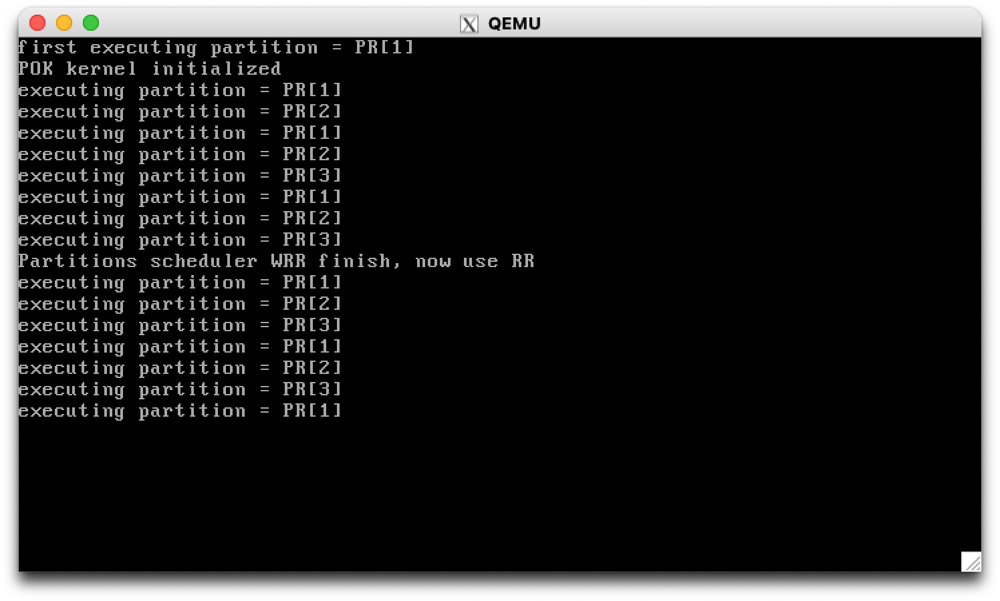
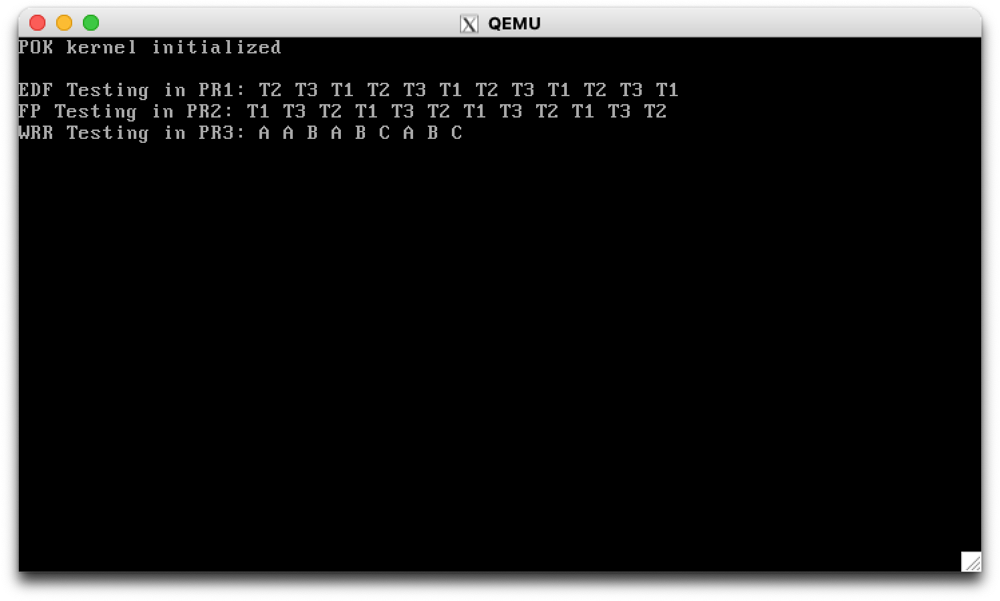

## 一、引言

设计测试用例，分别测试以下算法的正确性：

+ 分区调度：WRR
+ 线程调度：EDF、FP 和 WRR

## 二、分区调度算法

### 2.1 WRR 正确性测试

测试分区调度 WRR 算法的用户程序位于 `examples/test-part` 目录下。

包含 3 个分区，每个分区只有 1 个线程。

在 `kernel/deployment.h` 中申请使用分区 WRR 调度：

```c
#define POK_NEEDS_PARTITIONS_SCHEDULER 1
#define POK_CONFIG_PARTITIONS_TYPE POK_SCHED_WRR
```

定义各个分区的权重如下：

```c
#define POK_CONFIG_PARTITIONS_WEIGHT {4,3,2}
```

为了实现的简洁性，这里的 WRR 算法只会执行一遍，当执行完成后，会根据原来定义的 `POK_CONFIG_SCHEDULING_SLOTS_ALLOCATION` 序列依次执行（即 RR 算法）。

运行：

```
cd $POK_PATH/examples/test-part/
make clean; make all; make run
```

运行结果：



WRR 调度结果为 `1 1 2 1 2 3 1 2 3` ，与 WRR 算法结果一致。

## 三、线程调度算法

测试线程调度算法的用户程序位于 `examples/test-part` 目录下。

用户程序 `test-thread` 具有三个分区，分别用于测试以下算法：

+ 分区 1: EDF Testing
+ 分区 2: FP Testing
+ 分区 3: WRR Testing

### 3.1 正确性测试

首先，需要在 `examples/test-sched/kernel/deployment.h` 中指定各个分区的线程调度策略，声明如下宏定义：

```c
#define POK_CONFIG_PARTITIONS_SCHEDULER {POK_SCHED_EDF, POK_SCHED_PRIORITY, POK_SCHED_WRR}
```

#### 3.1.1 EDF

EDF 是根据线程属性的 `deadline` 来决定下一个执行的线程的，因此需要设置不同的 `deadline` ，观察输出，判断 EDF 是否执行正确的调度序列。

在 `pr1/main.c` 中，新建 3 个线程，其属性如下：

```c
int main()
{
  // ... ellipsis other thread attr settings
  attr.deadline = 100;
  attr.entry = t1;
  ret = pok_thread_create(&tid, &attr);

  attr.deadline = 20;
  attr.entry = t2;
  ret = pok_thread_create(&tid, &attr);

  attr.deadline = 60;
  attr.entry = t3;
  ret = pok_thread_create(&tid, &attr);
  //...
}
```

三个线程的分别输出 `T1, T2, T3` 的字符串，以 `t1` 为例：

```c
void *t1()
{
   uint8_t i;
   for (i = 0; i < N; i++)
   {
      printf("T1 ");
      pok_thread_sleep(sleep_val);
   }
   return NULL;
}
```

正确的输出应当为：`T2, T3, T1` 的重复序列。

#### 3.1.2 FP

FP (Fixed-Priority) 是根据线程属性的 `priority` 来决定下一个执行的线程的，因此需要设置不同的 `priority` ，观察输出，判断 FP 是否执行正确的调度序列。

在 `pr2/main.c` 中设置如下线程：

```c
int main()
{
  // ... ellipsis other settings
  attr.priority = 41;
  attr.entry = t1_job;
  ret = pok_thread_create(&tid, &attr);

  attr.priority = 43;
  attr.entry = t2_job;
  ret = pok_thread_create(&tid, &attr);

  attr.priority = 42;
  attr.entry = t3_job;
  ret = pok_thread_create(&tid, &attr);
  // ...
}
```

线程内容与 2.1.1 小节相同，只输出 `Ti` 格式的字符串。

此处，FP 的正确调度序列应当为 `T1 T3 T2` 的重复序列。 

#### 3.1.3 WRR

WRR (Weight-Round-Robin) 要求给线程设置不同的 `weight`，具体实现可参考文章：http://kb.linuxvirtualserver.org/wiki/Weighted_Round-Robin_Scheduling .

在 `pr3/main.c` 中设置上述参考文章的例子：

```c
int main()
{
  // ... ellipsis other settings
  attr.entry = t1_job;
  attr.weight = 4;
  ret = pok_thread_create(&tid, &attr);

  attr.weight = 3;
  attr.entry = t2_job;
  ret = pok_thread_create(&tid, &attr);

  attr.weight = 2;
  attr.entry = t3_job;
  ret = pok_thread_create(&tid, &attr);
  // ...
}
```

WRR 在此处的正确调度序列应当为 `AABABCABC`。

#### 3.1.4 测试结果

运行测试：

```c
cd $POK_PATH/examples/test-sched/
make clean; make all; make run
```

运行结果如下图所示：



### 3.2 对比分析

|  1   | 2    | 3    |
| :--: | ---- | ---- |
|      |      |      |
|      |      |      |
|      |      |      |

## 四、应用场景测试


