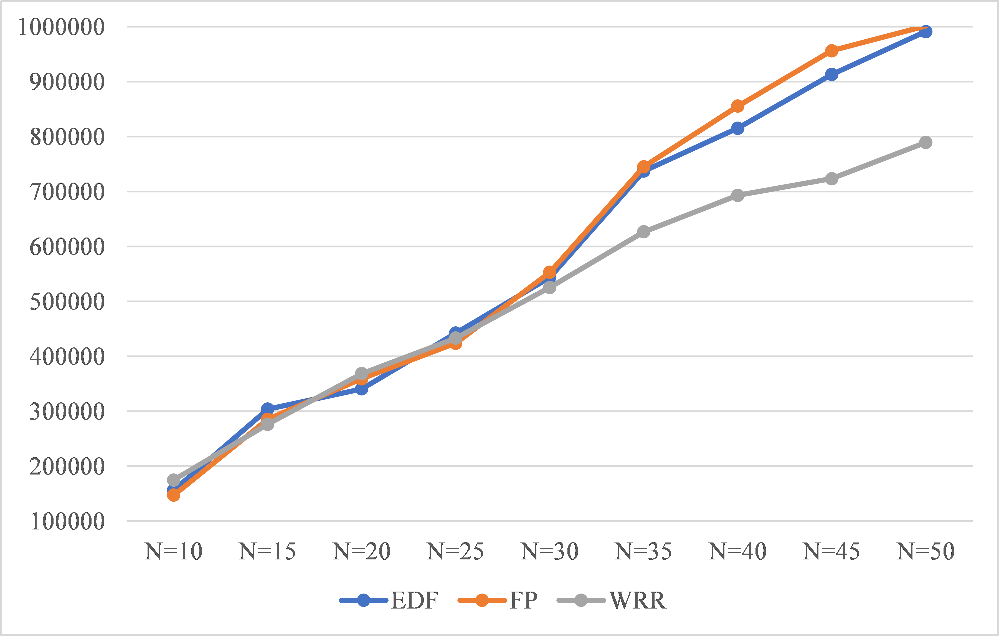

# Pok Kernel: 测试报告

## 小组信息

+ 120037910056 冼健邦
+ 517021910653 王祖来
+ 120037910066 夏沛言

## 目录

+ [一、引言](#一引言)
+ [二、分区调度算法](#二分区调度算法)
+ [三、线程调度算法](#三线程调度算法)
  - [3.1 EDF](#31-edf)
  - [3.2 FP](#32-fp)
  - [3.3 WRR](#33-wrr)
  - [3.4 测试结果](#34-测试结果)
+ [四、应用场景测试](#四应用场景测试)

## 一、引言

设计测试用例，分别测试以下算法的正确性：

+ 分区调度：WRR
+ 线程调度：EDF、FP 和 WRR
+ 基于设计的应用场景，对线程调度算法进行比较分析

## 二、分区调度算法

测试分区调度 WRR 算法的用户程序位于 `examples/test-part` 目录下。

包含 3 个分区，每个分区只有 1 个线程。

在 `kernel/deployment.h` 中申请使用分区 WRR 调度：

```c
#define POK_NEEDS_PARTITIONS_SCHEDULER 1
#define POK_CONFIG_PARTITIONS_TYPE POK_SCHED_WRR
```

定义各个分区的权重如下：

```c
#define POK_CONFIG_PARTITIONS_WEIGHT {4,3,2}
```

为了实现的简洁性，这里的 WRR 算法只会执行一遍，当执行完成后，会根据原来定义的 `POK_CONFIG_SCHEDULING_SLOTS_ALLOCATION` 序列依次执行（即 RR 算法）。

运行：

```
cd $POK_PATH/examples/test-part/
make clean; make all; make run
```

运行结果：


WRR 调度结果为 `1 1 2 1 2 3 1 2 3` ，与 WRR 算法结果一致。

## 三、线程调度算法

测试线程调度算法的用户程序位于 `examples/test-thread` 目录下。

用户程序 `test-thread` 具有三个分区，分别用于测试以下算法：

+ 分区 1: EDF Testing
+ 分区 2: FP Testing
+ 分区 3: WRR Testing

首先，需要在 `examples/test-thread/kernel/deployment.h` 中指定各个分区的线程调度策略，声明如下宏定义：

```c
#define POK_CONFIG_PARTITIONS_SCHEDULER {POK_SCHED_EDF, POK_SCHED_PRIORITY, POK_SCHED_WRR}
```

### 3.1 EDF

EDF 是根据线程属性的 `deadline` 来决定下一个执行的线程的，因此需要设置不同的 `deadline` ，观察输出，判断 EDF 是否执行正确的调度序列。

在 `pr1/main.c` 中，新建 3 个线程，其属性如下：

```c
int main()
{
  // ... ellipsis other thread attr settings
  attr.deadline = 100;
  attr.entry = t1;
  ret = pok_thread_create(&tid, &attr);

  attr.deadline = 20;
  attr.entry = t2;
  ret = pok_thread_create(&tid, &attr);

  attr.deadline = 60;
  attr.entry = t3;
  ret = pok_thread_create(&tid, &attr);
  //...
}
```

三个线程的分别输出 `T1, T2, T3` 的字符串，以 `t1` 为例：

```c
void *t1()
{
   uint8_t i;
   for (i = 0; i < N; i++)
   {
      printf("T1 ");
      pok_thread_sleep(sleep_val);
   }
   return NULL;
}
```

正确的输出应当为：`T2, T3, T1` 的重复序列。

### 3.2 FP

FP (Fixed-Priority) 是根据线程属性的 `priority` 来决定下一个执行的线程的，因此需要设置不同的 `priority` ，观察输出，判断 FP 是否执行正确的调度序列。

在 `pr2/main.c` 中设置如下线程：

```c
int main()
{
  // ... ellipsis other settings
  attr.priority = 41;
  attr.entry = t1_job;
  ret = pok_thread_create(&tid, &attr);

  attr.priority = 43;
  attr.entry = t2_job;
  ret = pok_thread_create(&tid, &attr);

  attr.priority = 42;
  attr.entry = t3_job;
  ret = pok_thread_create(&tid, &attr);
  // ...
}
```

线程内容与 3.1.1 小节相同，只输出 `Ti` 格式的字符串。

此处，FP 的正确调度序列应当为 `T1 T3 T2` 的重复序列。 

### 3.3 WRR

WRR (Weight-Round-Robin) 要求给线程设置不同的 `weight`，具体实现可参考文章：http://kb.linuxvirtualserver.org/wiki/Weighted_Round-Robin_Scheduling .

在 `pr3/main.c` 中设置上述参考文章的例子：

```c
int main()
{
  // ... ellipsis other settings
  attr.entry = t1_job;
  attr.weight = 4;
  ret = pok_thread_create(&tid, &attr);

  attr.weight = 3;
  attr.entry = t2_job;
  ret = pok_thread_create(&tid, &attr);

  attr.weight = 2;
  attr.entry = t3_job;
  ret = pok_thread_create(&tid, &attr);
  // ...
}
```

T1, T2, T3 三个线程分别会输出 `A, B, C` 的字符。

WRR 在此处的正确调度序列应当为 `AABABCABC`。

### 3.4 测试结果

测试数据如下：

+ EDF Deadline 设置：T1=100，T2=20，T3=60
+ FP Priority 设置：T1=41，T2=43，T3=42
+ WRR Weight 设置：T1(A) = 4，T2(B) = 3，T3(C) = 2

运行测试：

```c
cd $POK_PATH/examples/test-thread/
make clean; make all; make run
```

运行结果如下图所示：


## 四、应用场景测试

为了对比与测试不同调度算法对 POK Kernel 性能的影响，设计包含 3 个分区的用户程序：

+ 分区 1：单生产者-消费者模型
+ 分区 2：多生产者-消费者模型
+ 分区 3：为了测试多分区调度算法的有效性，设置为单线程分区

具体实现细节可参考设计报告。

相关代码均位于 `pok/examples/mydemo` 文件夹下。

对于分区 1 和 2 的生产者和消费者模型，均设置了一个参数 N ，表示生产者-消费者这些线程的操作次数（即在 buffer 中生产和消费 $N$ 个资源）。

下表为 $N$ 取不同的值时，用户程序 `mydemo` 在不同的线程调度算法下的平均执行时间。

计时通过函数 `pok_time_get()` 实现，单位是纳秒 (ns) 。

|      |  EDF   |   FP    |  WRR   |
| :--: | :----: | :-----: | :----: |
| N=10 | 156723 | 147504  | 175161 |
| N=15 | 304227 | 285789  | 276570 |
| N=20 | 341103 | 359541  | 368760 |
| N=25 | 442512 | 424074  | 433293 |
| N=30 | 543921 | 553140  | 525483 |
| N=35 | 737520 | 745330  | 626892 |
| N=40 | 801231 | 849355  | 699116 |
| N=45 | 912516 | 946094  | 727711 |
| N=50 | 996884 | 1006030 | 793967 |

通过上述数据导出折线图（如下图所示），实验数据表示，在多生产者-消费者模型下，当 $N > 35$ 时，WRR 算法具有明显的优势。

